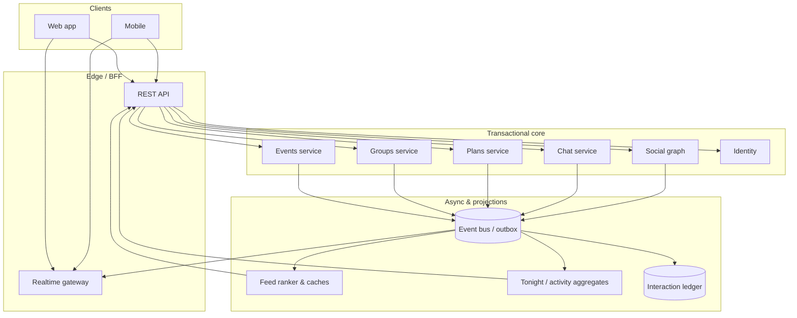

# Sparkd — Social Activity Engine (unified architecture)

**Purpose:** One conceptual backbone so Tonight Mode, Mutual Plans, Live / Nearby Activity, and Event Chats are features **on top of shared primitives**, not parallel silos.

---

## 1. Unified Social Activity Engine

The engine is the intersection of five pillars; every product feature reads **facts** from here and emits **signals** back into it.

| Pillar | Role | Examples |
|--------|------|-----------|
| **Events** | Time-bound social anchors | RSVPs, capacity, lifecycle (`OPEN` → `FINISHED`) |
| **Users** | Actors + preferences + reputation context | Profiles, consent, blocks, location policy |
| **Groups** | Persistent containers for people + chatter | Group feed, invites, roles |
| **Plans** | Intent / micro-commitments (“coffee @10”, mutual intent) | Plan entities, mutual matches, Tonight tiles |
| **Interactions** | Edges + signals | Follows, likes/reactions, joins, messages, poll votes |

**Core idea:** Features are **projections**. The engine stores canonical **relationships** and **activity facts**; APIs and feeds are **materialized views** (often cached or streamed).

---

## 2. Normalized data relationships

Think in terms of **entities** and **typed edges**. Multiple APIs can expose the same edge with different shapes (REST resource vs feed item vs socket payload).

### Entity ↔ entity (conceptual)

| Relationship | Cardinality | Canonical meaning |
|----------------|--------------|-------------------|
| **User ↔ Event** | N:M via participation | Roles: interested, pending, approved attendee, moderator, host |
| **User ↔ User** | N:M | Follow, match, block, mutual-follow → feeds Mutual Plans eligibility |
| **User ↔ Group** | N:M | Member role (`ADMIN` / `MODERATOR` / `GUEST`), invites |
| **Event ↔ Chat** | 1:1 (logical) | Event group chat room tied to `eventId`; lifecycle mirrors event |

### Supporting structures

- **Interaction ledger** (append-heavy): `actorId`, `verb`, `objectType`, `objectId`, `metadata`, `occurredAt` — backs analytics, Tonight scoring, feed hints.
- **Activity snapshots** (read-heavy): per-user or per-region aggregates (“velocity”, “live nearby”) refreshed by workers or incremental updates.

---

## 3. Event-driven architecture (behavior)

Commands mutate state; **domain events** propagate side effects. Clients stay simple: subscribe to **narrow channels** or poll **aggregates**.

| Trigger | Emitted event(s) (conceptual) | Downstream effects |
|---------|------------------------------|---------------------|
| User **joins / RSVPs** event | `Event.ParticipantChanged`, `Activity.Signal` | Feed row; Tonight score bump; capacity topic; optional chat system message |
| User **likes profile** (or mutual signal) | `Interaction.Created`, `Graph.MutualMaybeUpdated` | Mutual Plans projection refresh; notification optional |
| **Event created** | `Event.Created` | `Event.ChatProvisioned`; activity entry; Tonight/day bucket index |
| **Chat message** | `Chat.MessageSent` | Real-time fan-out; optional feed teaser for mods |
| **Poll vote** | `Poll.Voted` | Aggregate update; WS payload to thread subscribers |

**Ordering:** Prefer **per-resource sequencing** (e.g. `eventId`, `userId`, `groupId`) so UI can reconcile optimistic updates.

**Idempotency:** Join, invite accept, and “ensure chat room” must be **safe to retry** (already aligned with pre-event `ensureRoom` pattern).

---

## 4. Suggested backend structure

### Services (logical modules)

| Service | Responsibility |
|---------|----------------|
| **Identity & profile** | Users, sessions, blocks, privacy flags |
| **Social graph** | Follows, matches, mutual derivation |
| **Events** | CRUD, capacity, participants, moderation |
| **Groups** | Membership, invites, group-scoped settings |
| **Plans** | User/group plans, Tonight-linked aggregates |
| **Chat** | Threads rooms (event group, DM, future), messages, polls |
| **Interactions** | Reactions, likes, RSVP timeline signals → ledger |
| **Feed / personalization** | Ranking, segments, “why shown” metadata |
| **Realtime gateway** | WebSocket/SSE auth, topic subscriptions, fan-out |

### Endpoint grouping (REST namespaces)

Group routes **by resource**, not by screen name — screens compose multiple calls.

| Prefix | Resources |
|--------|-----------|
| `/api/users` | Profiles, settings, blocks |
| `/api/graph` or `/api/social` | Follows, matches (if not already split) |
| `/api/events` | Events, participants, **nested** `…/chat`, `…/group/*` |
| `/api/groups` | Groups, members, invites |
| `/api/plans` | Micro-plans, mutual-plan queries |
| `/api/activity-feed` | Home / personalized feed (already present — treat as **projection** only) |
| `/api/activity` | Nearby / live / trending aggregates (Tonight inputs) |
| `/api/tonight` | Curated “tonight” bundle (optional façade over `/api/activity` + `/api/events`) |
| `/api/interactions` or verbs on resources | Likes, reactions (`/api/likes/…` can migrate behind façade later) |
| `/api/realtime` | Token, subscription hints (optional if JWT embeds topics) |

### Real-time layer (WebSocket-ready)

- **Topics:** `user:{id}`, `event:{id}:group`, `event:{id}:capacity`, `feed:{userId}`, `region:{hash}` (coarse geo).
- **Payload envelope:** `{ type, resourceId, ts, payload }` — mirrors Interaction ledger verbs where possible.
- **Rules:** Auth at subscribe time; never leak cross-participant data without membership checks consistent with REST.

---

## 5. System capabilities checklist

| Capability | How the engine supports it |
|-------------|---------------------------|
| **Real-time UI** | Domain events → WS topics; same semantics as REST DTOs (avoid duplicate shapes long-term) |
| **Feed generation** | Ranked blend of Interaction ledger + Events + Plans + Groups; explainability field for debugging |
| **Personalization** | Explicit signals (follows, RSVPs, locale) + implicit (opens, dwell); segment caches per user/region |

---

## 6. Architecture diagram (description)

**High level:** Clients talk to **API Gateway / BFF** → **command handlers** write to **transactional stores** (events, graph, chat) and append **outbox / event bus**. **Consumers** update **read models** (Tonight aggregates, feed caches, search indexes). **Realtime service** reads from bus or polls projections and pushes to WebSocket clients.

---

## 7. Trello epic breakdown (copy/paste)

### Epic E0 — **Social Activity Engine platform**

Single backbone for relationships, ledger, and projections.

**Backend**

- **E0-B1** — Canonical **interaction ledger** schema + write API from existing verbs (RSVP, like, message meta).
- **E0-B2** — **Outbox / domain events** from Events, Graph, Chat (at-least-once delivery).
- **E0-B3** — **Projection workers**: feed fragments, Tonight scores, mutual-plan eligibility cache.
- **E0-B4** — **Realtime topic catalog** + auth matrix aligned with REST permissions.

**Frontend**

- **E0-F1** — **Unified activity hooks** layer (`useActivitySignals`, `useEventLifecycle`) consuming REST + WS same shapes where possible.
- **E0-F2** — **Feature flags** to gate migrations without splitting UX silos.

---

### Epic E1 — **Tonight Mode (projection)**

- **E1-B1** — `GET /api/tonight/*` as façade over shared aggregates (not bespoke queries).
- **E1-F1** — Tonight UI consumes only **engine-backed** DTOs; deprecate one-off client merges where redundant.

---

### Epic E2 — **Mutual Plans (graph + plans)**

- **E2-B1** — Plans service reads **mutual eligibility** from graph projection, not ad hoc joins in UI.
- **E2-F1** — Mutual Plans surfaces invalidated on `Graph.MutualMaybeUpdated`.

---

### Epic E3 — **Live / Nearby Activity**

- **E3-B1** — Region buckets + privacy gates as first-class in **Interactions / ledger**.
- **E3-F1** — Nearby strip subscribes to **`region:{hash}`** or polls aggregate keyed by engine version.

---

### Epic E4 — **Event chat & pre-event room**

- **E4-B1** — `Event.Created` → **idempotent** chat provision (already forward-compatible in app).
- **E4-B2** — Post-event archive as lifecycle node on **same Event ↔ Chat** edge.

---

### Epic E5 — **Personalization & feed**

- **E5-B1** — Feed service consumes ledger + projections; stable **`rankReason`** for QA.
- **E5-F2** — Empty/error states map to **engine states** (cold start, consent off), not per-screen guesses.

---

## Migration stance (pragmatic)

- Do **not** rewrite all endpoints at once: introduce **ledger + events** behind existing writes, then **collapse** duplicate client-side merges into projections.
- Keep **Tonight / Mutual / Nearby / Chat** as **thin features** on shared types (`eventId`, `userId`, `interactionVerb`, `topic`).

This document is the reference for aligning new PRs: if a change does not map to **entities**, **edges**, **ledger**, or **projection**, it likely belongs in the shared engine rather than a feature-local shortcut.
